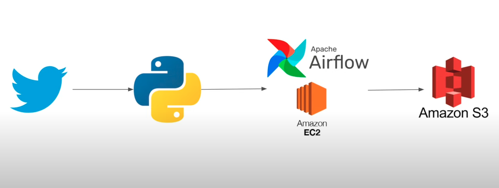

# Twitter-Data-Pipeline-using-Airflow

## Overview

This project aims to understand how Apache Airflow is used to securely manage, streamline, and upload the structured and semi-structured twitter tweet data based on individual user tweets or multiple users tweets.

## Project Goals
1. Data Ingestion — Build a mechanism to ingest data from twiteer.
2. ETL System — We are getting data in raw format, transforming this data into the proper format
3. Scalability — As the size of our data increases, we need to make sure our system scales with it
4. Cloud — We can’t process vast amounts of data on our local computer so we need to use the cloud, in this case, we will use AWS
5. Reporting — Build a dashboard to get answers to the question we asked earlier

## Services we will be using
1. Amazon S3: Amazon S3 is an object storage service that provides manufacturing scalability, data availability, security, and performance.
2. AWS IAM: This is nothing but identity and access management which enables us to manage access to AWS services and resources securely.
3. Apache Airflow: Apache Airflow is an open-source workflow management platform for data engineering pipelines.

## Architecture Diagram

